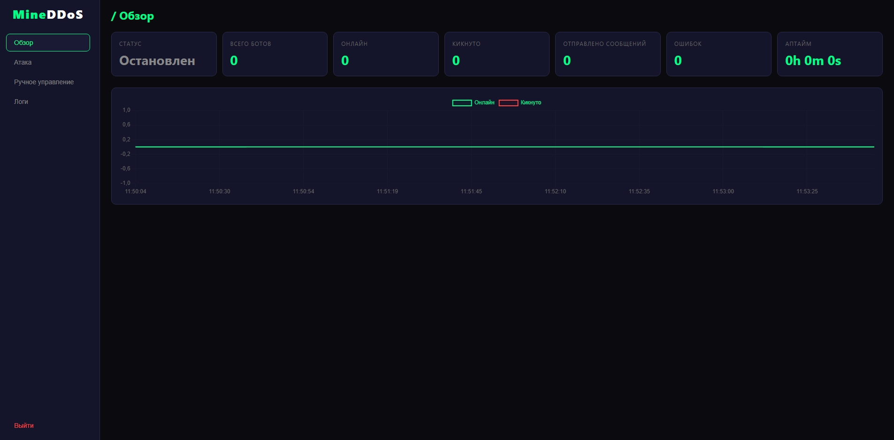
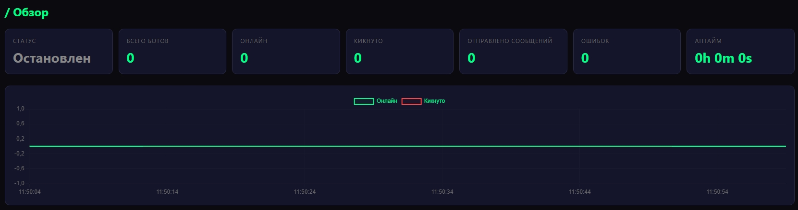
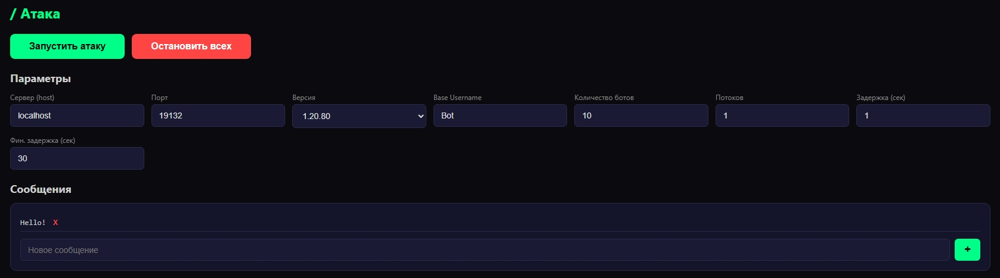
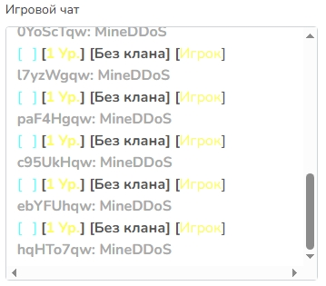
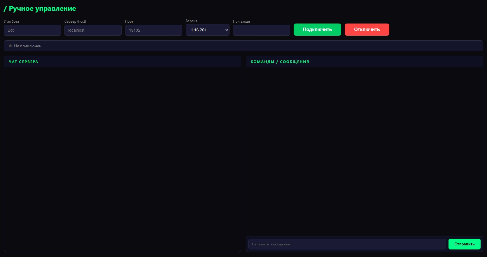

<div align="center">
  
  
  # ⚡ MineDDoS Bot Panel
  
  **Массовое подключение Minecraft Bedrock ботов к серверу**
  
  <p>
    
    
    
    
    
  </p>
</div>

---

## 📋 Оглавление

- [📸 Скриншоты](#-скриншоты)
- [🚀 Быстрый старт](#-быстрый-старт)
- [📁 Структура проекта](#-структура-проекта)
- [⚙️ Настройка](#️-настройка)
- [🛡️ Безопасность](#️-безопасность)
- [❓ Возможные проблемы](#-возможные-проблемы)
- [📜 Лицензия](#-лицензия)

---

## 📸 Скриншоты

<div align="center">
  <table>
    <tr>
      <td></td>
      <td></td>
      <td></td>
    </tr>
    <tr align="center">
      <td>📊 Панель</td>
      <td>📈 Монитор</td>
      <td>⚔️ Атака</td>
    </tr>
    <tr>
      <td></td>
      <td></td>
      <td></td>
    </tr>
    <tr align="center">
      <td>💬 Чат</td>
      <td>🎮 Ручное управление</td>
      <td></td>
    </tr>
  </table>
</div>

---

## 🚀 Быстрый старт

### 🔧 Требования

| Компонент   | Версия     | Скачать                                |
|-------------|------------|----------------------------------------|
| **Node.js** | v18 или выше | [nodejs.org](https://nodejs.org)     |
| **npm**     | встроен в Node.js | —                                   |

Поддерживаемые ОС: **Windows** · **Linux** · **macOS**

---

### 💻 Запуск одной командой

Выбери скрипт под свою ОС:

<table>
  <thead>
    <tr>
      <th>ОС</th>
      <th>Скрипт</th>
      <th>Как запустить</th>
    </tr>
  </thead>
  <tbody>
    <tr>
      <td><b>Windows</b></td>
      <td><code>start.bat</code></td>
      <td>Двойной клик по файлу</td>
    </tr>
    <tr>
      <td><b>Windows</b> (PowerShell)</td>
      <td><code>start.ps1</code></td>
      <td>ПКМ → Запуск в PowerShell</td>
    </tr>
    <tr>
      <td><b>Linux</b></td>
      <td><code>start.sh</code></td>
      <td><code>chmod +x start.sh && ./start.sh</code></td>
    </tr>
    <tr>
      <td><b>macOS</b></td>
      <td><code>start.sh</code></td>
      <td><code>chmod +x start.sh && ./start.sh</code></td>
    </tr>
  </tbody>
</table>

Скрипт сам проверит Node.js, установит зависимости и запустит панель.

---

### 📦 Ручной запуск

```bash
cd BotMCBE-RU
node start.js
```

**При первом запуске** start.js сделает всё автоматически:
1. Установит зависимости в `bot-core` и `web-panel`
2. Запросит пароль для входа в панель
3. Сгенерирует sessionSecret
4. Запустит веб-сервер

**При повторных запусках** просто стартует панель.

🌐 **Панель доступна по адресу:** `http://127.0.0.1:3000`

---

## 📁 Структура проекта

```
BotMCBE-RU/
├── 📄 start.js              # Точка входа (автоустановка + запуск)
├── 📄 start.bat             # Скрипт для Windows CMD
├── 📄 start.ps1             # Скрипт для Windows PowerShell
├── 📄 start.sh              # Скрипт для Linux / macOS
├── 📄 package.json          # Корневые зависимости
│
├─── 🧠 bot-core/             # Ядро ботов
│   ├── bot.js               #   Логика подключения к серверу
│   ├── config.json          #   Конфигурация ботов
│   └── package.json         #   Зависимости (bedrock-protocol)
│
└─── 🌐 web-panel/            # Веб-панель управления
    ├── server.js            #   Express + Socket.IO сервер
    ├── bot_controller.js    #   Контроллер массового запуска
    ├── single_bot.js        #   Управление одним ботом
    ├── setup.js             #   Смена пароля (с автоустановкой bcryptjs)
    ├── config.json          #   Настройки панели
    ├── package.json         #   Зависимости панели
    │
    └── 📂 public/           # Фронтенд (HTML/CSS/JS)
        ├── index.html       #   Страница логина
        ├── dashboard.html   #   Панель управления
        ├── app.js           #   Клиентский код
        └── style.css        #   Тёмная тема
```

---

## ⚙️ Настройка

### 🔧 web-panel/config.json

```json
{
  "panel": {
    "port": 3000,
    "passwordHash": "...",
    "sessionSecret": "..."
  },
  "botDefaults": {
    "host": "localhost",
    "port": 19132,
    "version": "1.20.80",
    "baseUsername": "Bot",
    "count": 10,
    "threadCount": 1,
    "delayBetweenBotsSeconds": 1,
    "finalDelaySeconds": 30,
    "messages": ["Hello!"]
  }
}
```

> ⚠️ **Важно:** `bot-core/config.json` полностью перезаписывается при запуске атаки через панель. Параметры берутся из `botDefaults`.

---

### 🔑 Смена пароля

**Способ 1** — через веб-интерфейс (API):

```
POST /api/change-password
Content-Type: application/json

{
  "token": "auth_ok",
  "oldPassword": "старый_пароль",
  "newPassword": "новый_пароль"
}
```

**Способ 2** — через скрипт setup.js:

```bash
cd BotMCBE-RU/web-panel
node setup.js
```

> setup.js автоматически установит bcryptjs, если его нет.

**Способ 3** — вручную отредактировать `web-panel/config.json` и перезапустить сервер.

---

### 📋 Команды npm (web-panel)

| Команда          | Описание                             |
|------------------|--------------------------------------|
| `npm start`      | Запуск сервера                       |
| `npm run setup`  | Генерация пароля и sessionSecret     |

---

## 🛡️ Безопасность

| Мера | Описание |
|------|----------|
| 🔒 Панель слушает только **127.0.0.1** | Локальный доступ |
| 🔐 Уникальный `sessionSecret` для каждой установки | Генерируется автоматически |
| 🔑 Хеширование пароля через bcrypt | Пароль не хранится в открытом виде |
| 🌐 Для удаленного доступа — reverse proxy с HTTPS | Рекомендуется nginx / Caddy |

---

## ❓ Возможные проблемы

| Проблема | Решение |
|----------|---------|
| ❌ `node` не найден | Установи Node.js с [nodejs.org](https://nodejs.org) |
| ❌ `npm install` падает с ошибкой | Проверь интернет, отключи VPN/прокси |
| ❌ Порт 3000 занят | Смени порт в `web-panel/config.json` (`panel.port`) |
| ❌ Ошибка `EACCES` (Linux/macOS) | Не запускай через sudo. Используй порт >1024 или npx |
| ❌ Боты не подключаются | Проверь host/port, версию Minecraft, не заблокирован ли IP |
| ❌ Ошибка в ручном управлении | Используй `npm install bedrock-protocol@latest` |

---

## 📜 Лицензия

```
MIT License

Copyright (c) 2024 Reikiiioi

Permission is hereby granted, free of charge, to any person obtaining a copy
of this software and associated documentation files...
```

Полный текст лицензии в файле [LICENSE](LICENSE).

---

<div align="center">
  <sub>Made with ❤️ by Reikiiioi</sub>
</div>
